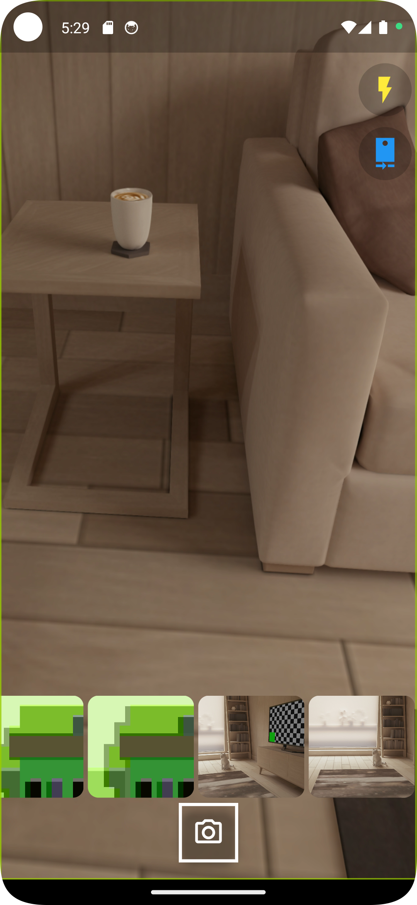
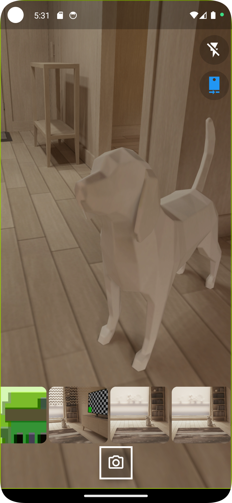
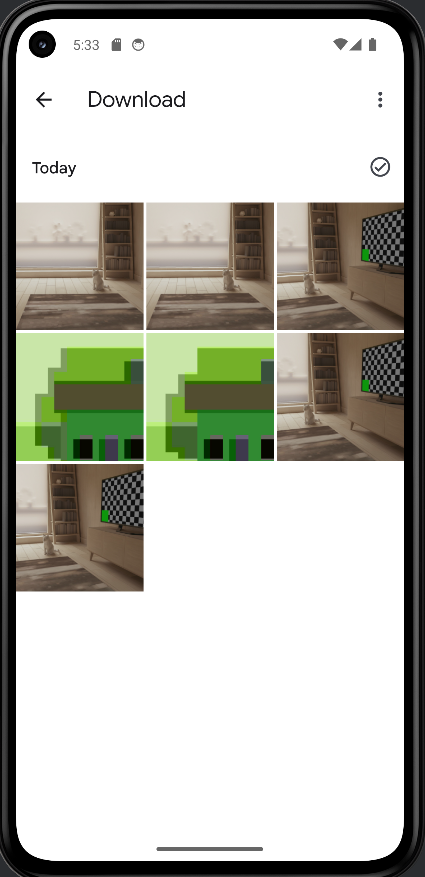
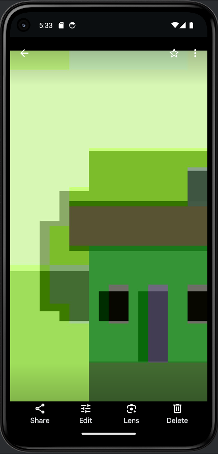

# Flutter Camera and Gallery App

This Flutter application integrates camera functionality using the `camera` package and gallery functionality using the `gal` package. Users can take pictures, switch cameras, toggle flash, and save images to device storage. Additionally, captured images are displayed in a scrollable list.

## Table of Contents

- [Flutter Camera and Gallery App](#flutter-camera-and-gallery-app)
  - [Table of Contents](#table-of-contents)
  - [Packages](#packages)
    - [Camera Package](#camera-package)
    - [Gal Package](#gal-package)
    - [Additional Packages](#additional-packages)
  - [Installation](#installation)
    - [Step 1: Add Dependencies](#step-1-add-dependencies)
    - [Step 2: Configure Android](#step-2-configure-android)
      - [Change the Minimum SDK Version](#change-the-minimum-sdk-version)
      - [Update Android Manifest](#update-android-manifest)
  - [Usage](#usage)
  - [Screenshots](#screenshots)
    - [Camera View](#camera-view)
    - [Gallery View](#gallery-view)
  - [Video Reference](#video-reference)
  - [License](#license)

## Packages

### Camera Package

The `camera` package is used to integrate camera functionality in the Flutter app.

- [Camera Package](https://pub.dev/packages/camera)

### Gal Package

The `gal` package is used to integrate gallery functionality in the Flutter app.

- [Gal Package](https://pub.dev/packages/gal)

### Additional Packages

- [Gap Package](https://pub.dev/packages/gap): For spacing between widgets.
- [External Path Package](https://pub.dev/packages/external_path): For accessing external storage paths.
- [Media Scanner Package](https://pub.dev/packages/media_scanner): For scanning media files (Android only).

## Installation

### Step 1: Add Dependencies

Add the following dependencies to your `pubspec.yaml` file:

```yaml
dependencies:
  flutter:
    sdk: flutter
    camera: ^0.11.0+1
  gal: ^2.3.0
  gap: ^3.0.1
  external_path: ^1.0.3
  media_scanner: ^2.1.0
```

### Step 2: Configure Android

#### Change the Minimum SDK Version

Change the minimum Android SDK version to 21 (or higher) in your `android/app/build.gradle` file:

```groovy
android {
    defaultConfig {
        minSdkVersion 21
    }
}
```

#### Update Android Manifest

Add the following keys to the `android/app/src/main/AndroidManifest.xml`:

```xml
<manifest xmlns:android="http://schemas.android.com/apk/res/android"
    package="com.example.yourapp">

    <application
        android:requestLegacyExternalStorage="true"
        ...>
        ...
    </application>

    <uses-feature android:name="android.hardware.camera" android:required="false" />
    <uses-permission android:name="android.permission.WRITE_EXTERNAL_STORAGE" />
    <uses-permission android:name="android.permission.READ_EXTERNAL_STORAGE" />
    <uses-permission android:name="android.permission.CAMERA" />
</manifest>
```

## Usage

This application includes the following functionalities:

1. **Flash Mode:** Toggle the flash on and off while taking pictures.
2. **Camera Switching:** Switch between front and rear cameras.
3. **Show Captured Images:** Display captured images in a horizontal scrollable list.
4. **Take Multiple Images:** Capture multiple images during a single session.
5. **Save Images to Device Storage:** Save captured images to device storage and make them visible in the phone's gallery.

## Screenshots

### Camera View

| Camera Application Screen                      | Camera Application Screen                      |
|------------------------------------------------|------------------------------------------------|
|  |  |

### Gallery View

| Phone Gallery                             | Phone Gallery                             |
|-------------------------------------------|-------------------------------------------|
|  |  |

## Video Reference

For a comprehensive tutorial, you can refer to this [YouTube video](https://youtu.be/j2xMGZ1XcMo?si=OBaVyezpGdttPJeU).

## License

This project is licensed under the MIT License.

In this README:

1. **Packages:** The `camera` , `gap` , `external_media` and `media_scanner` packages are introduced with their links.
2. **Installation:** Step-by-step instructions for adding dependencies, changing the minimum SDK version, and updating the Android manifest.
3. **Usage:** Brief explanation and links to official documentation for using the packages.
4. **Screenshots:** Completed project screenshots of "Camera View" and "Gallery View."
5. **Video Reference:** Link to the YouTube video for a detailed walkthrough.
6. **License:** Standard license information.
