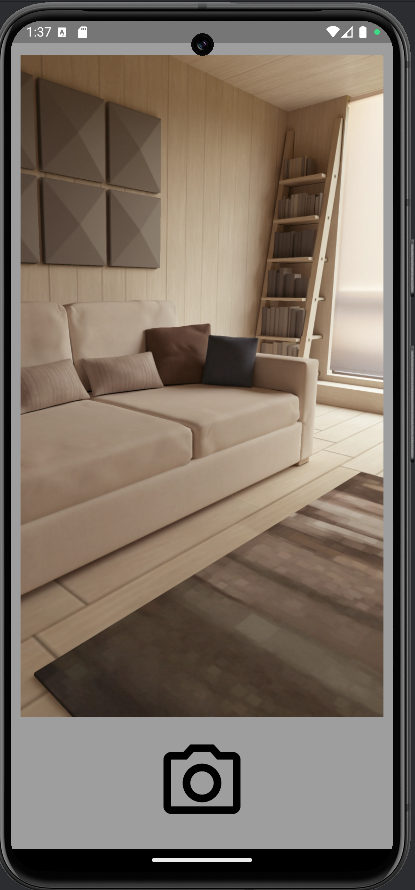

# Flutter Camera and Gallery App

This Flutter application demonstrates how to integrate the Camera and Gallery features using the `camera` and `gal` packages.

## Packages

### Camera Package

The `camera` package is used to integrate camera functionality in the Flutter app.

- [Camera Package](https://pub.dev/packages/camera)

### Gal Package

The `gal` package is used to integrate gallery functionality in the Flutter app.

- [Gal Package](https://pub.dev/packages/gal)

## Installation

### Step 1: Add Dependencies

Add the following dependencies to your `pubspec.yaml` file:

```yaml
dependencies:
  flutter:
    sdk: flutter
  camera: ^0.9.4+5
  gal: ^0.1.4
```

### Step 2: Configure Android

#### Change the Minimum SDK Version

Change the minimum Android SDK version to 21 (or higher) in your `android/app/build.gradle` file:

```groovy
android {
    defaultConfig {
        minSdkVersion 21
    }
}
```

#### Update Android Manifest

Add the following keys to the `android/app/src/main/AndroidManifest.xml`:

```xml
<manifest xmlns:android="http://schemas.android.com/apk/res/android"
    package="com.example.yourapp">

    <application
        android:requestLegacyExternalStorage="true"
        ...>
        ...
    </application>

    <uses-permission android:name="android.permission.WRITE_EXTERNAL_STORAGE" />
    <uses-permission android:name="android.permission.READ_EXTERNAL_STORAGE" />
    <uses-permission android:name="android.permission.CAMERA" />
</manifest>
```

## Usage

### Camera

Use the `camera` package to access the device camera and capture photos or videos. Follow the [official documentation](https://pub.dev/packages/camera) for detailed usage instructions.

### Gallery

Use the `gal` package to access the device gallery and pick images or videos. Follow the [official documentation](https://pub.dev/packages/gal) for detailed usage instructions.

## Screenshots

### Camera View

| Camera Application Screen                      | Camera Application Screen                      |
|------------------------------------------------|------------------------------------------------|
|  |  |

### Gallery View

| Phone Gallery                             | Phone Gallery                             |
|-------------------------------------------|-------------------------------------------|
|  |  |

## Video Reference

For a detailed walkthrough, refer to the [YouTube video](https://youtu.be/TrmoRtn5MZA?si=vu5nv7Ku2rkjq6Oc).

## License

This project is licensed under the MIT License.

In this README:

1. **Packages:** The `camera` and `gal` packages are introduced with their links.
2. **Installation:** Step-by-step instructions for adding dependencies, changing the minimum SDK version, and updating the Android manifest.
3. **Usage:** Brief explanation and links to official documentation for using the packages.
4. **Screenshots:** Tables for inserting images with headings for "Camera View" and "Gallery View."
5. **Video Reference:** Link to the YouTube video for a detailed walkthrough. Thanks to Hussain Mustafa's Video Tutorial.
6. **License:** Standard license information.
